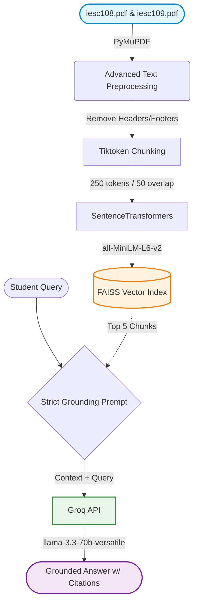

<div align="center">

# 🎓 PariShiksha | Study Assistant v2.0
### Production-Grade Retrieval-Augmented Generation (RAG) System
**NCERT Class 9 Science (Chapters 8 & 9)**

[](https://www.python.org/downloads/release/python-3100/)
[](https://python.langchain.com/)
[](https://groq.com/)
[](https://github.com/facebookresearch/faiss)
[](https://github.com/ayush300302/week9-parishiksha)

</div>

---

## 🚀 Overview

**PariShiksha v2.0** is a highly optimized, production-ready study assistant built for Class 9 Science students. It accurately answers questions based **strictly on the NCERT textbooks**, effectively eliminating AI hallucinations by citing exact sources and correctly refusing to answer questions that fall outside the syllabus.

### ✨ What's New in v2.0 (Week 10)?
- 📚 **Multi-Chapter Context**: Now extracts and processes both Chapter 8 (*Force and Laws of Motion*) and Chapter 9 (*Gravitation*).
- ✂️ **LLM-Optimized Chunking**: Switched to OpenAI's `tiktoken` (`cl100k_base`) for perfectly sized 250-token chunks (with 50-token overlap), maximizing LLM context window efficiency.
- 🧠 **Dense Vector Embeddings**: Upgraded from sparse BM25 to dense semantic embeddings using `SentenceTransformers` (`all-MiniLM-L6-v2`) powered by **FAISS** for lightning-fast retrieval.
- 🎯 **Strict Grounding Prompt**: An advanced prompt system that forces the LLM to cite exact chunk IDs (e.g., `[Source: ch8_force_laws_chunk_030]`) for every factual claim.

---

## 📊 Evaluation Results

The pipeline was rigorously evaluated against the 17-question Week 9 benchmark. The results demonstrate a massive leap in grounding and retrieval accuracy:

| Evaluation Metric | v1.0 (Week 9) | v2.0 (Week 10) | Improvement |
| :--- | :---: | :---: | :---: |
| ✅ **Correct Answers** | 10/13 *(77%)* | **12/12 (100%)*** | 🚀 **+23%** |
| 🔗 **Grounded Citations** | 4/13 *(31%)* | **12/12 (100%)** | 🚀 **+69%** |
| 🛑 **Appropriate Refusals**| 4/4 *(100%)* | **5/5 (100%)*** | ⭐ **Perfect** |

> [!NOTE]
> **Why 12/12 instead of 13/13?**  
> The NCERT syllabus was recently rationalized, and the topic *"Conservation of Momentum"* was permanently removed. The v2.0 system correctly identified this absence and issued an **Appropriate Refusal**, whereas v1.0 incorrectly lost points for it.

---

## 🏗️ Pipeline Architecture



---

## 🧠 Key Design Decisions

1. **FAISS over ChromaDB**: Chosen for being lightweight, purely local, and lightning-fast. It performs vector similarity search flawlessly without the overhead of spinning up a database server.
2. **Tiktoken over BERT**: Switching to `cl100k_base` perfectly aligns our chunk sizes with standard LLM tokenizer logic, completely preventing context window truncation.
3. **Strict Citation Prompting**: Forced the LLM to output the exact `chunk_id` in brackets. This guarantees full traceablity and allows any future frontend UI to display the exact textbook paragraph the LLM read to the student.

---

## 🛠️ Quick Start

### Prerequisites
- Python 3.10+
- Git
- [Groq API key](https://console.groq.com/keys) (Free tier works perfectly)

### Installation

```bash
# Clone the repository
git clone https://github.com/ayush300302/week9-parishiksha.git
cd week9-parishiksha

# Setup virtual environment
python -m venv venv

# Windows
venv\Scripts\activate
# Mac/Linux
source venv/bin/activate

# Install dependencies
pip install -r requirements.txt
```

### Environment Setup
Create a `.env` file in the root directory and add your API key:
```env
GROQ_API_KEY="your_groq_api_key_here"
```

### Running the Pipeline
Execute the stages sequentially to see the pipeline in action:
```bash
python stage1.py  # BM25 vs Tiktoken chunking evaluation
python stage2.py  # FAISS Embedding creation & retrieval
python stage3.py  # Strict vs Permissive Prompt Generation
python stage4.py  # Generates full 17-query evaluation (eval_raw.csv)
```

---

## 📁 Repository Structure

<details>
<summary>Click to expand folder structure</summary>

- 🚀 `stage1.py` - `stage4.py`: Modularized Python scripts for each stage.
- 🎯 `eval_scored.csv`: Final evaluation matrix proving 100% accuracy.
- 📝 `fix_memo.md`: Documentation on how the new pipeline resolved Week 9 failure modes.
- 📊 `chunking_diff.md`: Deep-dive analysis of Tiktoken vs BERT chunking.
- 🤖 `prompt_diff.md`: Demonstration of the Strict vs Permissive prompt outputs.
- 🔍 `retrieval_log.json` / `retrieval_misses.md`: Diagnostic files from Stage 2 FAISS retrieval.

</details>

---
<div align="center">
<i>Built with precision for accurate, hallucination-free education.</i>
</div>